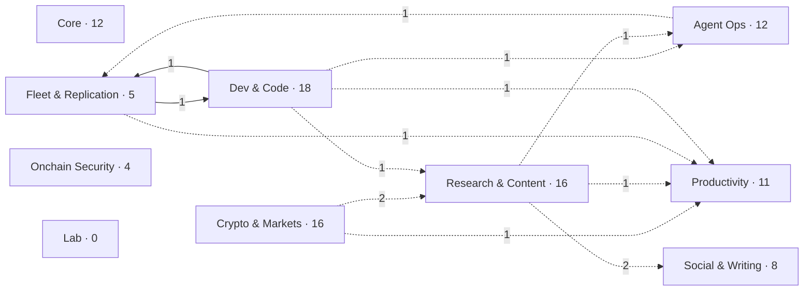
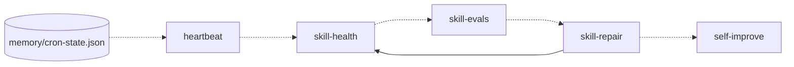

# Skill Dependency Graph

_Auto-generated by capabilities-map (var=graph) on 2026-07-02._

Navigable Mermaid dependency map of the **102** live Aeon skills. This reflects the
post-consolidation inventory (**203 → 102** skills across 10 packs); every node links
to its `SKILL.md`. Edges are drawn only from concrete evidence — `depends_on`
frontmatter, `aeon.yml` chain/reactive config, and shared `memory/` state that one
skill writes and another reads. When the signal was ambiguous, the edge was omitted.

## Edge legend

| Arrow | Meaning | Source |
|---|---|---|
| `A --> B` | **depends_on** — A requires B (points to its dependency) | `depends_on:` frontmatter |
| `A -.-> B` | **consume** — B injects A's `.outputs/` in a chain | `aeon.yml` `chains:` `consume:` |
| `A -..-> B` | **shared-state / reactive** — A writes a `memory/` file (or article) B reads, or A triggers B | derived + `reactive:` triggers |

- **Bold, black-bordered node = `enabled: true`** in `aeon.yml`. Only **`heartbeat`**
  (schedule `0 8,14,20 * * *`) is enabled today; all other nodes are faded (disabled/on-demand).
- **`chains:` and `reactive:` are template-only** — every block in `aeon.yml` is currently
  commented out, so **no `consume:` (`-.->`) or trigger (`-..->`-reactive) edges are active**.
  The `-.->` legend row documents the format for when chains are enabled.
- **Universal write collapsed:** every skill writes `memory/cron-state.json` (liveness). That
  100-way fan-in to `heartbeat`/`skill-health`/`skill-repair` is intentionally **not drawn** —
  it would swamp the graph. Treat it as an implicit edge from every node into the self-healing loop.
- Click any node on github.com to open its `SKILL.md`.

## Architecture overview

Cross-pack edges only, aggregated to pack → pack with edge counts. Solid = `depends_on`,
dotted = shared-state / content-pipeline. Intra-pack edges are omitted here (see the full map below).

## Self-healing loop

The core observability/repair cycle. The only hard edge is `skill-repair --> skill-health`
(`depends_on`); the rest is the documented loop — health/evals file issues into
`memory/issues/`, repair closes them by PR, and `cron-state.json` is the shared liveness ledger
every skill writes.

## Full map — per-pack subgraphs

Every skill, grouped by pack. Cross-pack edges connect nodes across subgraph boundaries.

```mermaid
flowchart LR
  subgraph core["Core (12)"]
    autoresearch["autoresearch"]
    cost-report["cost-report"]
    create-skill["create-skill"]
    digest["digest"]
    heartbeat["heartbeat · enabled · 0 8,14,20"]:::enabled
    install-skill["install-skill"]
    onboard["onboard"]
    reflect["reflect"]
    self-improve["self-improve"]
    skill-evals["skill-evals"]
    skill-health["skill-health"]
    skill-repair["skill-repair"]
  end

  subgraph fleet["Fleet & Replication (5)"]
    deploy-prototype["deploy-prototype"]
    distribute-tokens["distribute-tokens"]
    fleet-control["fleet-control"]
    spawn-instance["spawn-instance"]
    vuln-scanner["vuln-scanner"]
  end

  subgraph research["Research & Content (16)"]
    article["article"]
    article-queue["article-queue"]
    bd-radar["bd-radar"]
    deep-research["deep-research"]
    fetch-tweets["fetch-tweets"]
    framework-watch["framework-watch"]
    hn-digest["hn-digest"]
    idea-forge["idea-forge"]
    last30["last30"]
    launch-radar["launch-radar"]
    narrative-convergence["narrative-convergence"]
    paper-digest["paper-digest"]
    paper-pick["paper-pick"]
    reddit-digest["reddit-digest"]
    security-digest["security-digest"]
    telegram-digest["telegram-digest"]
  end

  subgraph dev["Dev & Code (18)"]
    auto-merge["auto-merge"]
    auto-workflow["auto-workflow"]
    changelog["changelog"]
    code-health["code-health"]
    ecosystem-pulse["ecosystem-pulse"]
    feature["feature"]
    fork-fleet["fork-fleet"]
    github-monitor["github-monitor"]
    github-trending["github-trending"]
    inbox-triage["inbox-triage"]
    issue-triage["issue-triage"]
    pr-review["pr-review"]
    pr-triage["pr-triage"]
    repo-scanner["repo-scanner"]
    search-skill["search-skill"]
    star-milestone["star-milestone"]
    vuln-tracker["vuln-tracker"]
    workflow-audit["workflow-audit"]
  end

  subgraph markets["Crypto & Markets (16)"]
    base-mcp["base-mcp"]
    ctrl["ctrl"]
    defi-overview["defi-overview"]
    fear-divergence["fear-divergence"]
    monitor-polymarket["monitor-polymarket"]
    narrative-tracker["narrative-tracker"]
    onchain-monitor["onchain-monitor"]
    picks-tracker["picks-tracker"]
    pm-manipulation["pm-manipulation"]
    pm-pulse["pm-pulse"]
    price-alert["price-alert"]
    token-movers["token-movers"]
    token-pick["token-pick"]
    treasury-info["treasury-info"]
    unlock-monitor["unlock-monitor"]
    x402-monitor["x402-monitor"]
  end

  subgraph hound["Onchain Security (4)"]
    investigation-report["investigation-report"]
    tx-explain["tx-explain"]
    vigil["vigil"]
    wallet-profile["wallet-profile"]
  end

  subgraph social["Social & Writing (8)"]
    farcaster-digest["farcaster-digest"]
    mention-radar["mention-radar"]
    product-hunt["product-hunt"]
    reply-maker["reply-maker"]
    schedule-ads["schedule-ads"]
    soul-builder["soul-builder"]
    syndicate-article["syndicate-article"]
    write-tweet["write-tweet"]
  end

  subgraph productivity["Productivity (11)"]
    action-converter["action-converter"]
    deal-flow["deal-flow"]
    followup-patrol["followup-patrol"]
    goal-tracker["goal-tracker"]
    idea-pipeline["idea-pipeline"]
    note-taking["note-taking"]
    reg-monitor["reg-monitor"]
    send-email["send-email"]
    shiplog["shiplog"]
    strategy-builder["strategy-builder"]
    tool-builder["tool-builder"]
  end

  subgraph agentops["Agent Ops (12)"]
    api-health["api-health"]
    batch-health["batch-health"]
    capabilities-map["capabilities-map"]
    contributor-leaderboard["contributor-leaderboard"]
    fork-events["fork-events"]
    fork-health["fork-health"]
    memory-flush["memory-flush"]
    operator-scorecard["operator-scorecard"]
    product-pulse["product-pulse"]
    skill-gap["skill-gap"]
    skill-scan["skill-scan"]
    skill-update["skill-update"]
  end

  %% ── depends_on (solid, dependent --> dependency) ──
  feature --> repo-scanner
  skill-repair --> skill-health
  tool-builder --> action-converter
  vuln-scanner --> github-trending
  vuln-tracker --> vuln-scanner

  %% ── shared-state & content-pipeline (dotted, producer -..-> consumer) ──
  defi-overview -..-> article-queue
  defi-overview -..-> fear-divergence
  defi-overview -..-> idea-pipeline
  defi-overview -..-> x402-monitor
  idea-forge -..-> idea-pipeline
  idea-forge -..-> launch-radar
  deploy-prototype -..-> idea-pipeline
  framework-watch -..-> launch-radar
  repo-scanner -..-> product-pulse
  repo-scanner -..-> idea-pipeline
  repo-scanner -..-> narrative-convergence
  fork-health -..-> fork-events
  fork-health -..-> skill-gap
  contributor-leaderboard -..-> distribute-tokens
  pm-pulse -..-> pm-manipulation
  vuln-tracker -..-> inbox-triage
  github-monitor -..-> vuln-tracker
  article-queue -..-> article
  article-queue -..-> product-pulse
  narrative-tracker -..-> article-queue
  article -..-> syndicate-article
  deep-research -..-> syndicate-article

  classDef default fill:#f5f5f5,stroke:#bbb,color:#888
  classDef enabled fill:#fff,stroke:#111,stroke-width:3px,color:#111,font-weight:bold

  click autoresearch "../skills/autoresearch/SKILL.md"
  click cost-report "../skills/cost-report/SKILL.md"
  click create-skill "../skills/create-skill/SKILL.md"
  click digest "../skills/digest/SKILL.md"
  click heartbeat "../skills/heartbeat/SKILL.md"
  click install-skill "../skills/install-skill/SKILL.md"
  click onboard "../skills/onboard/SKILL.md"
  click reflect "../skills/reflect/SKILL.md"
  click self-improve "../skills/self-improve/SKILL.md"
  click skill-evals "../skills/skill-evals/SKILL.md"
  click skill-health "../skills/skill-health/SKILL.md"
  click skill-repair "../skills/skill-repair/SKILL.md"
  click deploy-prototype "../skills/deploy-prototype/SKILL.md"
  click distribute-tokens "../skills/distribute-tokens/SKILL.md"
  click fleet-control "../skills/fleet-control/SKILL.md"
  click spawn-instance "../skills/spawn-instance/SKILL.md"
  click vuln-scanner "../skills/vuln-scanner/SKILL.md"
  click article "../skills/article/SKILL.md"
  click article-queue "../skills/article-queue/SKILL.md"
  click bd-radar "../skills/bd-radar/SKILL.md"
  click deep-research "../skills/deep-research/SKILL.md"
  click fetch-tweets "../skills/fetch-tweets/SKILL.md"
  click framework-watch "../skills/framework-watch/SKILL.md"
  click hn-digest "../skills/hn-digest/SKILL.md"
  click idea-forge "../skills/idea-forge/SKILL.md"
  click last30 "../skills/last30/SKILL.md"
  click launch-radar "../skills/launch-radar/SKILL.md"
  click narrative-convergence "../skills/narrative-convergence/SKILL.md"
  click paper-digest "../skills/paper-digest/SKILL.md"
  click paper-pick "../skills/paper-pick/SKILL.md"
  click reddit-digest "../skills/reddit-digest/SKILL.md"
  click security-digest "../skills/security-digest/SKILL.md"
  click telegram-digest "../skills/telegram-digest/SKILL.md"
  click auto-merge "../skills/auto-merge/SKILL.md"
  click auto-workflow "../skills/auto-workflow/SKILL.md"
  click changelog "../skills/changelog/SKILL.md"
  click code-health "../skills/code-health/SKILL.md"
  click ecosystem-pulse "../skills/ecosystem-pulse/SKILL.md"
  click feature "../skills/feature/SKILL.md"
  click fork-fleet "../skills/fork-fleet/SKILL.md"
  click github-monitor "../skills/github-monitor/SKILL.md"
  click github-trending "../skills/github-trending/SKILL.md"
  click inbox-triage "../skills/inbox-triage/SKILL.md"
  click issue-triage "../skills/issue-triage/SKILL.md"
  click pr-review "../skills/pr-review/SKILL.md"
  click pr-triage "../skills/pr-triage/SKILL.md"
  click repo-scanner "../skills/repo-scanner/SKILL.md"
  click search-skill "../skills/search-skill/SKILL.md"
  click star-milestone "../skills/star-milestone/SKILL.md"
  click vuln-tracker "../skills/vuln-tracker/SKILL.md"
  click workflow-audit "../skills/workflow-audit/SKILL.md"
  click base-mcp "../skills/base-mcp/SKILL.md"
  click ctrl "../skills/ctrl/SKILL.md"
  click defi-overview "../skills/defi-overview/SKILL.md"
  click fear-divergence "../skills/fear-divergence/SKILL.md"
  click monitor-polymarket "../skills/monitor-polymarket/SKILL.md"
  click narrative-tracker "../skills/narrative-tracker/SKILL.md"
  click onchain-monitor "../skills/onchain-monitor/SKILL.md"
  click picks-tracker "../skills/picks-tracker/SKILL.md"
  click pm-manipulation "../skills/pm-manipulation/SKILL.md"
  click pm-pulse "../skills/pm-pulse/SKILL.md"
  click price-alert "../skills/price-alert/SKILL.md"
  click token-movers "../skills/token-movers/SKILL.md"
  click token-pick "../skills/token-pick/SKILL.md"
  click treasury-info "../skills/treasury-info/SKILL.md"
  click unlock-monitor "../skills/unlock-monitor/SKILL.md"
  click x402-monitor "../skills/x402-monitor/SKILL.md"
  click investigation-report "../skills/investigation-report/SKILL.md"
  click tx-explain "../skills/tx-explain/SKILL.md"
  click vigil "../skills/vigil/SKILL.md"
  click wallet-profile "../skills/wallet-profile/SKILL.md"
  click farcaster-digest "../skills/farcaster-digest/SKILL.md"
  click mention-radar "../skills/mention-radar/SKILL.md"
  click product-hunt "../skills/product-hunt/SKILL.md"
  click reply-maker "../skills/reply-maker/SKILL.md"
  click schedule-ads "../skills/schedule-ads/SKILL.md"
  click soul-builder "../skills/soul-builder/SKILL.md"
  click syndicate-article "../skills/syndicate-article/SKILL.md"
  click write-tweet "../skills/write-tweet/SKILL.md"
  click action-converter "../skills/action-converter/SKILL.md"
  click deal-flow "../skills/deal-flow/SKILL.md"
  click followup-patrol "../skills/followup-patrol/SKILL.md"
  click goal-tracker "../skills/goal-tracker/SKILL.md"
  click idea-pipeline "../skills/idea-pipeline/SKILL.md"
  click note-taking "../skills/note-taking/SKILL.md"
  click reg-monitor "../skills/reg-monitor/SKILL.md"
  click send-email "../skills/send-email/SKILL.md"
  click shiplog "../skills/shiplog/SKILL.md"
  click strategy-builder "../skills/strategy-builder/SKILL.md"
  click tool-builder "../skills/tool-builder/SKILL.md"
  click api-health "../skills/api-health/SKILL.md"
  click batch-health "../skills/batch-health/SKILL.md"
  click capabilities-map "../skills/capabilities-map/SKILL.md"
  click contributor-leaderboard "../skills/contributor-leaderboard/SKILL.md"
  click fork-events "../skills/fork-events/SKILL.md"
  click fork-health "../skills/fork-health/SKILL.md"
  click memory-flush "../skills/memory-flush/SKILL.md"
  click operator-scorecard "../skills/operator-scorecard/SKILL.md"
  click product-pulse "../skills/product-pulse/SKILL.md"
  click skill-gap "../skills/skill-gap/SKILL.md"
  click skill-scan "../skills/skill-scan/SKILL.md"
  click skill-update "../skills/skill-update/SKILL.md"
```

## Key patterns

### Hubs (most-connected skills)

| Skill | Pack | Degree | Role |
|---|---|---|---|
| `idea-pipeline` | productivity | 4 in | Execution-gap sink — reads market-context, startup-ideas, prototypes, ecosystem |
| `defi-overview` | crypto | 4 out | Market-context source feeding research, crypto, productivity |
| `repo-scanner` | dev | 3 out + 1 in | Repo-intelligence spine (`repos.md` / `ecosystem.md`) for feature, product-pulse, idea-pipeline, narrative-convergence |
| `article-queue` | research | 2 in / 2 out | Content planner — consumes defi/narrative signals, feeds `article` + product-pulse |
| `vuln-tracker` | dev | 2 out / 1 in | Vuln lifecycle poll — depends on vuln-scanner, reads pr-status, feeds inbox-triage |

### Data providers (write a `memory/` file another skill reads)

| Producer | Shared file | Consumers |
|---|---|---|
| `defi-overview` | `memory/topics/market-context.md` | article-queue, fear-divergence, idea-pipeline, x402-monitor |
| `repo-scanner` | `memory/topics/repos.md`, `ecosystem.md` | feature, product-pulse, idea-pipeline, narrative-convergence |
| `idea-forge` | `memory/topics/startup-ideas.md` (+ `-screened.md`) | idea-pipeline, launch-radar |
| `fork-health` | `memory/topics/fork-cohort-state.json` | fork-events, skill-gap |
| `framework-watch` | `memory/topics/framework-watch-state.json` | launch-radar |
| `github-monitor` | `memory/topics/pr-status.md` | vuln-tracker |
| `pm-pulse` | `memory/topics/prediction-markets.md` | pm-manipulation |
| `vuln-tracker` | `memory/topics/vuln-followup.md` | inbox-triage |
| `contributor-leaderboard` | `articles/contributor-leaderboard-*.md` | distribute-tokens |
| `deploy-prototype` | `memory/topics/prototypes.md` | idea-pipeline |
| `article-queue` | `memory/topics/article-queue.md` | article, product-pulse |

### Content pipeline

`article` and `deep-research` (plus other long-form writers — `digest`, `shiplog`,
`telegram-digest`, `changelog`, `bd-radar`, `launch-radar`, …) emit `articles/*.md`. The single
live publisher, **`syndicate-article`**, syncs every file in `articles/` to the Jekyll gallery
(`docs/_posts/`), Dev.to, and Farcaster. Legacy standalone publishers were retired in the
203→102 consolidation, so `syndicate-article` is the only content-pipeline sink in this graph.

## Summary

| Pack | Skills |
|---|---|
| Core | 12 |
| Fleet & Replication | 5 |
| Research & Content | 16 |
| Dev & Code | 18 |
| Crypto & Markets | 16 |
| Onchain Security | 4 |
| Social & Writing | 8 |
| Productivity | 11 |
| Agent Ops | 12 |
| Lab | 0 |
| **Total** | **102** |

| Edge type | Count |
|---|---|
| `depends_on` (`-->`) | 5 |
| `consume` (`-.->`) | 0 (template — chains commented out) |
| `reactive` trigger (`-..->`) | 0 (template — reactive commented out) |
| shared-state / content (`-..->`) | 22 |
| **Total drawn** | **27** |

**Enabled:** 1 / 102 (`heartbeat`).

---

`skills parsed: 102 · depends_on: 5 · consume: 0 (template) · reactive: 0 (template) · shared-state/content derived: 22 · enabled: 1/102 · mode: SKILL_GRAPH_OK`
